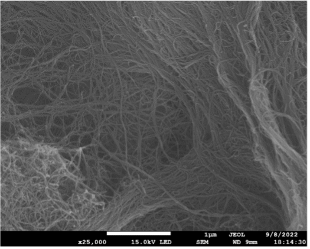
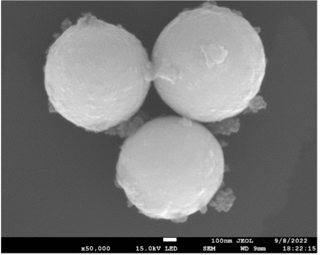
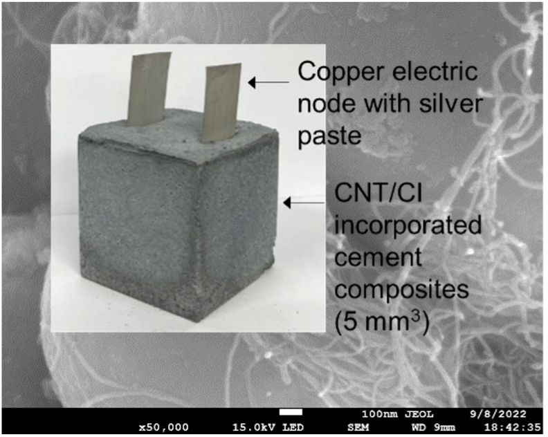
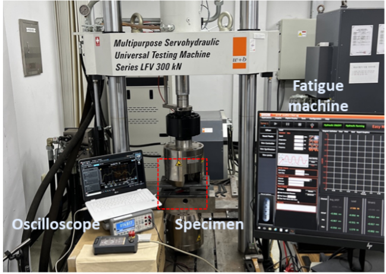
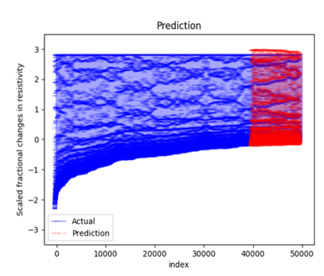

# Cement-based

> Multi-Directional Cement-Based Sensors with CNT@CIP Nanohybrids for Enhanced Sensing and Reliability.

# Introduction

In the domain of structural health monitoring, cement-based sensors have garnered considerable attention for their utility in load detection. However, their existing designs are limited to gauging the magnitude of applied forces without identifying their directional orientation. Addressing this gap, the current research introduces an innovative methodology for fabricating multi-dimensional cement-based sensors. This approach integrates carbon nanotube and carbonyl iron powder (CNT@CIP) nanohybrid clusters into the cement matrix during the fabrication phase and modulates their conductive networks through magnetization-induced curing processes. Subsequently, these advanced sensors undergo a comprehensive evaluation of their piezoresistive sensing attributes. Furthermore, a transformer model is employed to forecast their long-term sensing reliability. This research provides foundational insights for the creation of cement-based sensors capable of multi-directional load detection and long-term operational efficacy.

> Carbon nanotubes (CNTs); Carbonyl iron powder (CIP); Nanohybrid clusters; Multi-directional sensors; Transformer

# Experiments

## Materials

### CNT

### CI and CNT/CI Hybrid Cluster

### Nanofiller-Incorporated Cement Composites

## Overview of Piezoresistive Test Setup

# Network

## Network Architectures

.png)

## Implementation Details

Our implementation is derived from the publicly available PyTorch, allowing us to build our model using Transformer encoder and perform training and evaluation on multiple GPUs installed in a single system.

On a system equipped with two NVIDIA RTX 3080 TI GPUs, training a single net took about 30 minutes depending on the architecture.

## Results

| Metrics | MAPE(%) |  MAE  | RMSE  |
|:-------:|:-------:|:-----:|-------|
|         |  2.399  | 0.038 | 0.057 |

## References

> Planned to be written in the near future